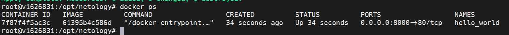

1.
2. В файле personal.auto.tfvars
3.  "result": "w8kN4UFBcRVe8Stn
4. 
5. Исправленный код:
resource "docker_image" "nginx" {
  name         = "nginx:latest"
  keep_locally = true
}

resource "docker_container" "nginx" {
  image = docker_image.nginx.image_id
  name  = "nginx"

6. 

7.
{
  "version": 4,
  "terraform_version": "1.5.7",
  "serial": 21,
  "lineage": "eec39a4f-cedf-cea2-1a2f-ef16171490fc",
  "outputs": {},
  "resources": [],
  "check_results": null
}

8. docker-image не будет удален из-за опции keep_locally:true . При значении true образ при выполнении terraform destroy не будет удален, в значении false - удаляется