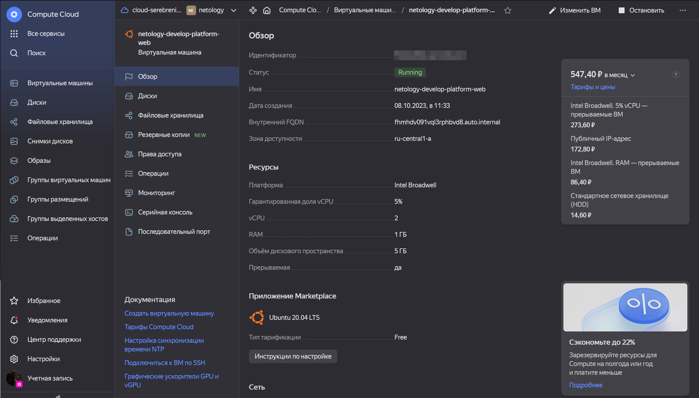

###Задание 1
1. 
<details><summary>Скриншот ЛК Yandex Cloud с созданной ВМ:</summary>



</details>

<details><summary>Скриншот успешного подключения к консоли ВМ через ssh:</summary>


</details>

Исправлены ошибки:
* В блоке resource.yandex_compute_instance.platform_id `standart-v4` на `standard-v1`,  [по документации](https://cloud.yandex.ru/docs/compute/concepts/vm-platforms) нет платформы v4. Также ошибка в слове standart --> standard
* В блоке resource.yandex_compute_instance.recources.cores изменен 1 --> 2, [по документации](https://cloud.yandex.ru/docs/compute/concepts/performance-levels) для `standard-v1` минимальное значение - 2 vcpu

- `preemptible = true` - машина может остановиться, если прошло 24 часа с момента запуска или возникнет нехватка ресурсов в той же зоне доступности. Помогоает экономить бюджет, в случае если мы забыли её уничтожить.
- `core_fraction=5` - при уровне производительности 5% ВМ будет иметь доступ к физическим ядрам как минимум 5% времени. Экономит бюджет, т.к. ресурсы не используются на полную.

###Задание 4
Вывод terraform output
```
db_external_ip_address = "51.250.11.153"
web_external_ip_address = "158.160.37.187"
```